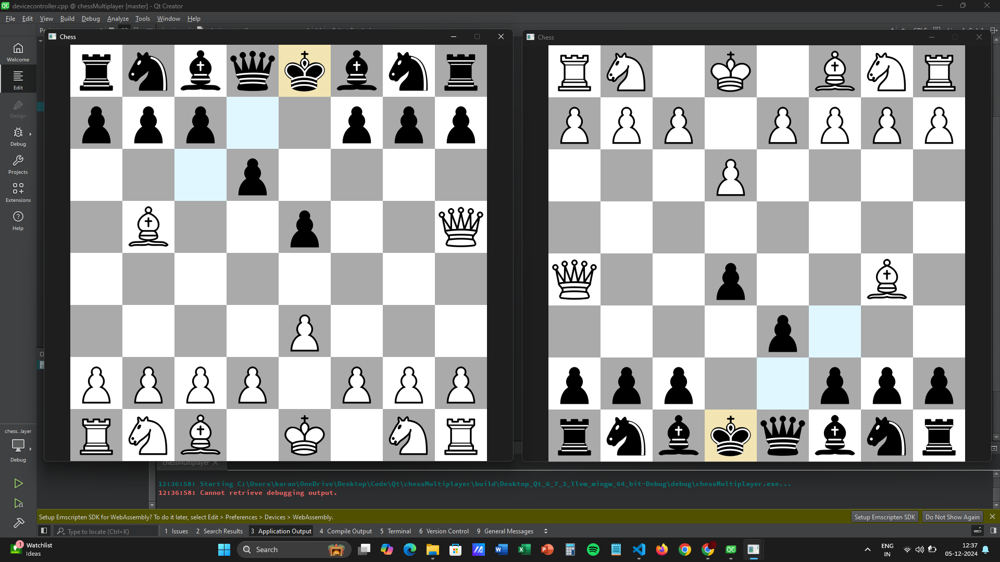

<h1 align="center">Chess using Qt</h1>

## About The Project

It's a program using Qt with C++ for the Graphical Interface and its Sockets implementation for connection to a server. With a separate C program which acts as server and when users conenct it forms a connection between two players.
  The users should be able to:
 1. Move chess pieces 
 2. With all check tracing shown on the board 
 3. Can anticipate for discover checks
 4. When a piece is selected shows the viable and piece taking places on board

## Architecture

Multiple users can connect to a server using TCP sockets. Then the server will match the users with each other and whenever an user makes a move the message is passed to server then the server passes the message to the other player acting as a middlemen. This way the users don't the other player and his location.

## Built instructions

1. Run two Qt instances of the program  
 2. Run the server.c program separately in terminal using 'gcc server.c -o server.c'
 3. Now can play the game

## Built with

- Qt using C++
- C for server
- Networking Sockets

## Attribution

The Pieces are from an group called Green Chess under an <a href='https://creativecommons.org/licenses/by-sa/3.0/deed.en'>Attribute and Share Alike</a> <a href='https://en.wikipedia.org/wiki/Creative_Commons'>(CreativeCommons)</a>.

Link for Chess Pieces - <a href='https://greenchess.net/info.php?item=downloads'>Link</a>
